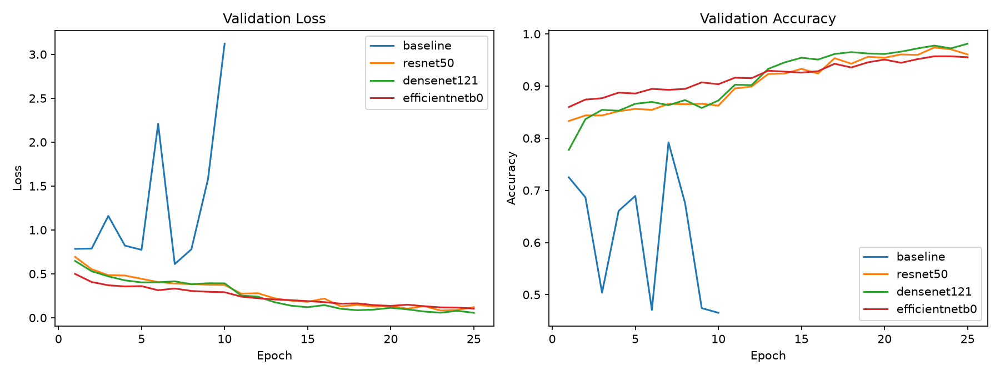
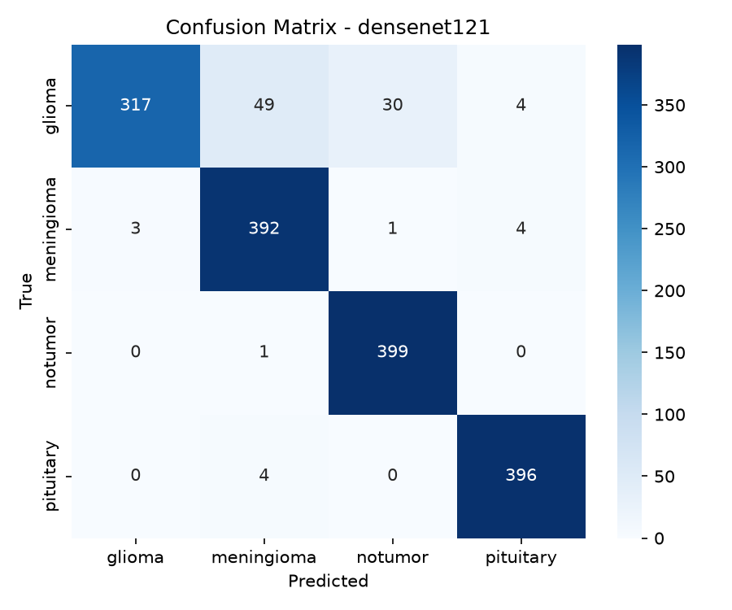
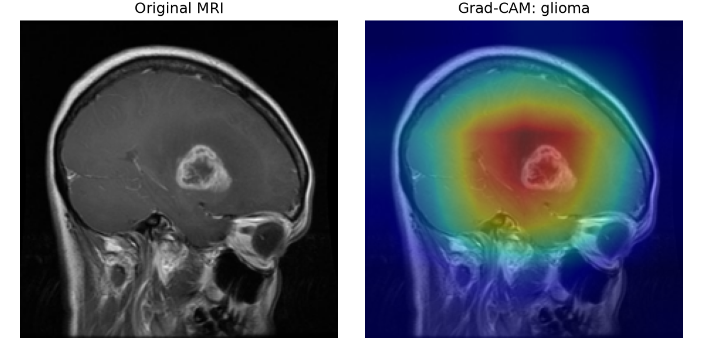

# 腦部 MRI 腫瘤分類 — 遷移學習與可解釋性

以深度學習對腦部 MRI 影像進行四類別腫瘤分類（glioma / meningioma / pituitary / no tumor），比較自建 CNN 與三種預訓練架構，並以 Grad-CAM 提供可解釋性分析。PyTorch 實作。

> 深度學習課程期末專題

## 主要結果

四個模型於測試集（每類 400 張、共 1600 張）的表現：

| 模型 | 測試準確率 | 參數量 (M) | Macro F1 | Macro AUC | 延遲 (ms/張) | 吞吐量 (張/秒) |
|---|---|---|---|---|---|---|
| **DenseNet121** | **0.9400** | 6.96 | 0.9384 | 0.9846 | 10.29 | 1120.5 |
| ResNet50 | 0.9350 | 23.52 | 0.9334 | 0.9841 | 4.04 | 1153.2 |
| EfficientNet-B0 | 0.9019 | 4.01 | 0.8999 | 0.9806 | 5.14 | 2785.4 |
| baseline (從頭訓練) | 0.7113 | 0.09 | 0.7049 | 0.8866 | 0.36 | 3602.7 |



## 主要發現

- **遷移學習效益顯著**：最佳的 DenseNet121（94.0%）較從頭訓練的 baseline（71.1%）高出約 23 個百分點。
- **glioma 是一致的辨識瓶頸**：所有模型對 glioma 的召回率皆最低（最佳約 79%），主要被誤判為 meningioma，可能與該資料集 glioma 類別已知的標註疑慮有關。
- **兩階段微調有效**：訓練曲線顯示解凍骨幹微調後，驗證準確率明顯躍升。
- **Grad-CAM 佐證合理性**：模型的關注區域多落在腫瘤病灶上，而非影像背景。

<p align="center">
  
  
</p>

## 專案結構

```
.
├── config.py          # 路徑與超參數
├── data.py            # 資料載入、擴增、類別權重
├── models.py          # baseline CNN + 三種遷移學習 backbone
├── train.py           # 兩階段微調訓練
├── evaluate.py        # 分類報告、混淆矩陣、ROC-AUC
├── compare.py         # 彙整各模型：準確率 / 參數量 / 推論速度
├── plot_curves.py     # 訓練曲線視覺化
├── gradcam.py         # Grad-CAM 可解釋性
├── requirements.txt
└── README.md
```

## 環境設定

以 conda 建立環境（於 Ubuntu + NVIDIA GPU 測試）：

```bash
conda create -n dl python=3.11 -y
conda activate dl

# CUDA 版 PyTorch（依你的 CUDA 版本調整 cu124 / cu121）
pip install torch torchvision --index-url https://download.pytorch.org/whl/cu124
pip install -r requirements.txt
```

> macOS（Apple Silicon）改用 `pip install torch torchvision`，程式會自動選用 MPS。

## 資料準備

本 repo 不含資料集。請至 Kaggle 下載
[Brain Tumor MRI Dataset](https://www.kaggle.com/datasets/masoudnickparvar/brain-tumor-mri-dataset)，
解壓後使其結構為 `Training/`、`Testing/` 各含四類別子資料夾，
再於 `config.py` 將 `DATA_DIR` 指向該資料夾。

## 使用方式

```bash
# 1. 訓練四個模型
python train.py --backbone baseline
python train.py --backbone resnet50
python train.py --backbone densenet121
python train.py --backbone efficientnetb0

# 2. 評估（分類報告 / 混淆矩陣 / ROC）
python evaluate.py --backbone densenet121

# 3. 架構比較表（準確率 / 參數量 / 推論速度）
python compare.py

# 4. 訓練曲線
python plot_curves.py

# 5. Grad-CAM 可解釋性
python gradcam.py --backbone densenet121 --image <某張測試影像路徑>
```

所有產出（權重、圖表）會存於 `outputs/`。

## 授權

程式碼以 MIT License 授權（見 `LICENSE`）。
資料集版權歸原作者所有，使用請遵循其 Kaggle 授權條款。

## 參考

- He et al., *Deep Residual Learning for Image Recognition*, CVPR 2016.
- Huang et al., *Densely Connected Convolutional Networks*, CVPR 2017.
- Tan & Le, *EfficientNet*, ICML 2019.
- Selvaraju et al., *Grad-CAM*, ICCV 2017.
- Nickparvar, M., *Brain Tumor MRI Dataset*, Kaggle, 2021.
